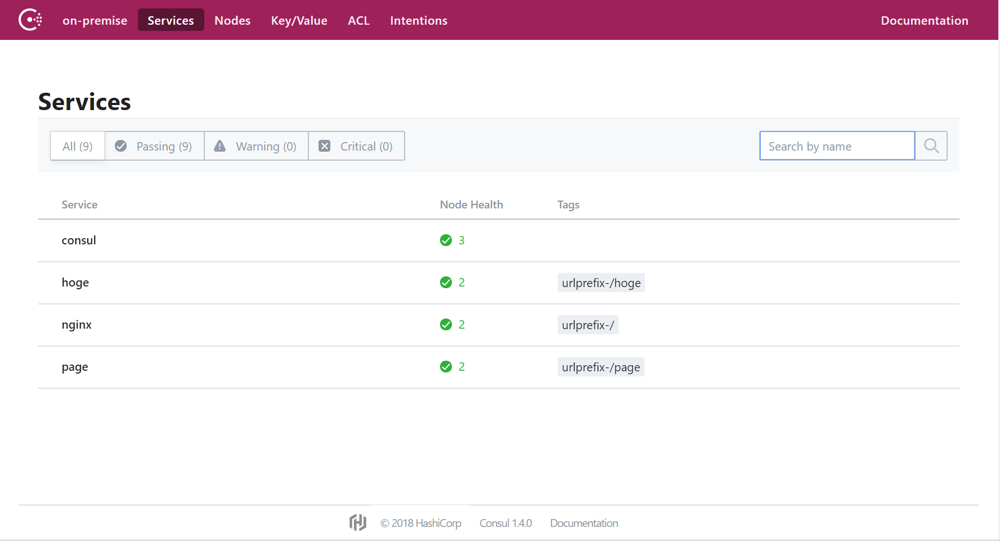
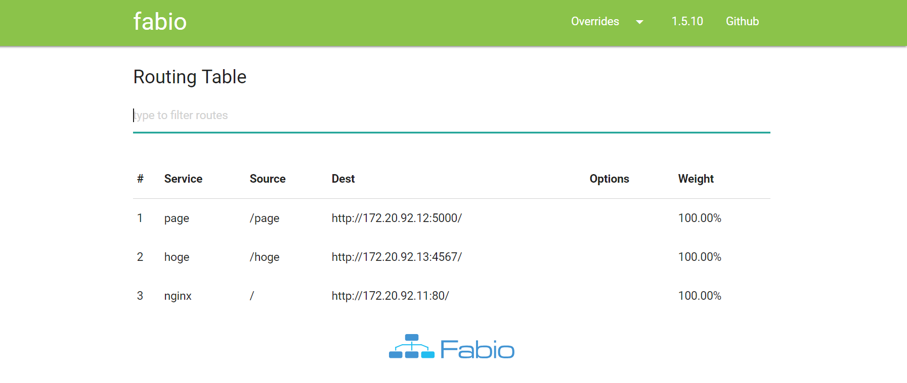

# consul-fabio-integration
consul and fabio make it easy small container orchestration.

## Overview

consul provide service discovery and own cluster networking.
fabio detect application services from consul cluster networking.

consul connect provide service mesh.
but, I guess, This solution is more excelent.

look like netflix eureka and zuul.
therefore, this solution is able to use non java applications and docker container.

## Features

consul and fabio provide following features.

* Service Discovery
* Services Self Registration to fabio 
* API Gateway

## Installation

### Consul

[Install Consul](https://www.consul.io/docs/install/index.html)

### Fabio

fabio install
```
# curl -O https://github.com/fabiolb/fabio/releases/download/v1.5.10/fabio-1.5.10-go1.11.1-linux_amd64
# mv fabio-1.5.10-go1.11.1-linux_amd64 fabio
# chmod 755 fabio
# mv fabio /usr/lcocal/bin
```

To start fabio run
```
# fabio
```

or use custom configuration file.
```
# fabio -cfg fabio.properties
```

fabio default http listner port is '0.0.0.0:9990' and web ui listener port '0.0.0.0:9998'

started fabio process, after connect consul cluster.
and discovery consul services.

We will beadding tiny logic into consul configuration files. this is magic.
```
TBD
```

Important, adding tag property urlprefix.

Consul Services into Other VM, 

## Servers

Runnging Processes and Lister Port into VM01.

```
=======================
|        VM01         |
=======================
|  proc  :    port    |
=======================
| Consul : 8500, 8600 |
| fabio  : 9999, 9998 |
| Nginx  : 80         |
=======================
```

Runnging Processes and Lister Port into VM02.
```
=======================
|        VM02         |
=======================
|  proc  :    port    |
=======================
| Consul : 8500, 8600 |
| APP    : 5000       |
=======================
```

Runnging Processes and Lister Port into VM03.
```
=======================
|        VM03         |
=======================
|  proc  :    port    |
=======================
| Consul : 8500, 8600 |
| APP    : 4567       |
=======================
```

## WEB UI

Consul and Fabio provice WEB UI Consule.
It is enable to confirm registerd services and added routing.

### Consul

http://[VM01 IPAddress]:8500



### Fabio

http://[VM01 IPAddress]:9998



## REST API

Confirm registerd servce using REST API on VM01
```
# curl -s http://localhost:9998/api/routes
[
    {
        "service":"page",
        "host":"",
        "path":"/page",
        "src":"/page",
        "dst":"http://172.20.92.12:5000/",
        "opts":"",
        "weight":1,
        "cmd":"route add",
        "rate1":0,
        "pct99":0
    },
    {
        "service":"hoge",
        "host":"",
        "path":"/hoge",
        "src":"/hoge",
        "dst":"http://172.20.92.13:4567/",
        "opts":"",
        "weight":1,
        "cmd":"route add",
        "rate1":0,
        "pct99":0
    },
    {
        "service":"nginx",
        "host":"",
        "path":"/",
        "src":"/",
        "dst":"http://172.20.92.11:80/",
        "opts":"",
        "weight":1,
        "cmd":"route add",
        "rate1":0,
        "pct99":0
    }
]
```

## Confirm

Route Nginx
```
# curl http://localhost:9999
<!DOCTYPE html>
<html>
<head>
<title>Welcome to nginx!</title>
<style>
    body {
        width: 35em;
        margin: 0 auto;
        font-family: Tahoma, Verdana, Arial, sans-serif;
    }
</style>
</head>
<body>
<h1>Welcome to nginx!</h1>
<p>If you see this page, the nginx web server is successfully installed and
working. Further configuration is required.</p>

<p>For online documentation and support please refer to
<a href="http://nginx.org/">nginx.org</a>.<br/>
Commercial support is available at
<a href="http://nginx.com/">nginx.com</a>.</p>

<p><em>Thank you for using nginx.</em></p>
</body>
</html>
```

Route page service
```
# curl http://localhost:9999/page
{ message: "page" }
```

Route hoge service
```
# curl http://localhost:9999/hoge
{ message : "hoge"}
```


